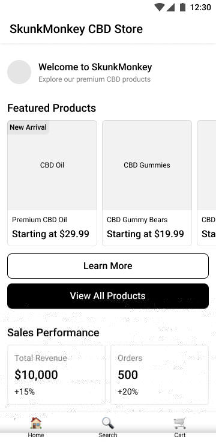
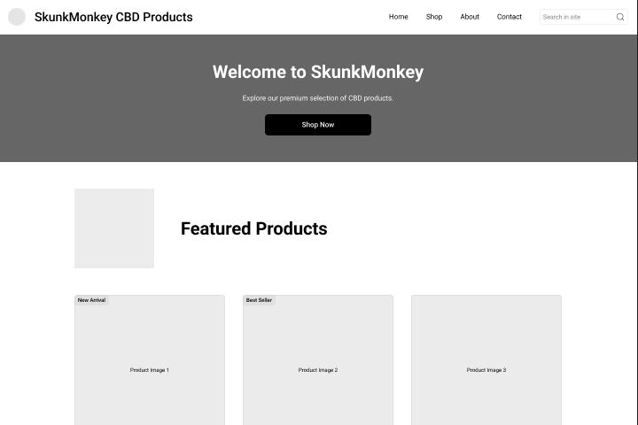

# SkunkMonkey E-Commerce Platform

SkunkMonkey is a **Django-based e-commerce platform** designed for seamless
browsing, product discovery, secure transactions, and efficient order management.
Built using **Agile methodologies**, the project follows a structured **KanBan**
approach to ensure a smooth and organized development workflow.

Live Site: **[Coming Soon]**
Test Credentials: **[To be added]**

---

## 📖 Contents

- [Project Goals](#-project-goals)
- [Screenshots](#-screenshots)
- [User Experience](#-user-experience)
  - [Epics](#-epics)
  - [User Stories](#-user-stories)
  - [Site Structure](#-site-structure)
    - [Wireframes](#-wireframes)
    - [Database Schema](#-database-schema)
  - [Design Choices](#-design-choices)
- [Agile Project Management](#-agile-project-management)
- [Marketing Strategy](#-marketing-strategy)
- [Features](#-features)
- [Testing](#-testing)
- [Validations](#-validations)
- [Deployment](#-deployment)
- [Credits](#-credits)

---

## 🎯 Project Goals

The goal of **SkunkMonkey** is to build a **fully functional, scalable
e-commerce platform** where users can **browse**, **search**, **purchase**, and
**manage orders** efficiently. The platform will feature **user authentication,
product browsing, shopping cart functionality, and an admin management system**.

This project is being built using **Django, PostgreSQL, Vite, and Bootstrap**,
with an emphasis on **security, performance, and a mobile-friendly UI**. The
frontend assets are managed through **Vite**, providing faster build times and
an improved development experience.

[Back to top](#-contents)

---

## 📸 Screenshots

### **Desktop View:**

|  |
|--------------------------------------------|

### **Mobile View:**

|  |  |
|------------------|------------------|

[Back to top](#-contents)

---

## 🏗️ User Experience

### 📌 Epics

This project follows an **Agile development workflow**, structured around
**GitHub KanBan**. Below are the main **epics**, each representing a key area
of the project:

- **[Initialization & Django Setup](https://github.com/Hedgemonkey/skunkmonkey/projects)**
- **[User Registration & Authentication](https://github.com/Hedgemonkey/skunkmonkey/projects)**
- **[Product Browsing & Search](https://github.com/Hedgemonkey/skunkmonkey/projects)**
- **[Shopping Cart & Checkout](https://github.com/Hedgemonkey/skunkmonkey/projects)**
- **[Admin & Order Management](https://github.com/Hedgemonkey/skunkmonkey/projects)**
- **[UI/UX Design](https://github.com/Hedgemonkey/skunkmonkey/projects)**
- **[Marketing & SEO](https://github.com/Hedgemonkey/skunkmonkey/projects)**
- **[Deployment & Testing](https://github.com/Hedgemonkey/skunkmonkey/projects)**
- **[Database Design & Schema](https://github.com/Hedgemonkey/skunkmonkey/projects)**
- **[Project Documentation & README](https://github.com/Hedgemonkey/skunkmonkey/projects)**

### 📝 User Stories

Each **epic** is further broken down into **user stories**, detailing the
features from the perspective of different users. A full list of user stories
can be found on the **GitHub KanBan board**.

Here are a few **example user stories**:

- As a **visitor**, I want to **search for products using a keyword**, so that
  **I can quickly find specific items**.
- As a **registered user**, I want to **add items to my shopping cart**, so that
  **I can purchase them later**.
- As an **admin**, I want to **manage customer orders**, so that **I can process
  purchases efficiently**.

[Back to top](#-contents)

---

## 🏗️ Site Structure

### **📐 Wireframes**

To plan the layout and user interface of the SkunkMonkey site, wireframes were
designed using **Figma**. These wireframes outline the **mobile and desktop
layouts**, ensuring a user-friendly experience across different devices.

📌 **View the full wireframe design on Figma:**
🔗 [**SkunkMonkey Wireframes - Figma**](https://www.figma.com/design/NtLORpnMv7M6mVMJa75GGX/SkunkMonkey?node-id=1-589&t=N44x2kvD9axQSaAY-1)

#### **📱 Mobile Wireframe**



#### **💻 Desktop Wireframe**



[Back to top](#-contents)

---

### 📄 Overview

The SkunkMonkey site will be structured around the following pages:

- **Home Page** – Displays featured products, promotions, and categories.
- **Product Listings** – Browse products with search and filtering options.
- **Product Details** – View individual product information.
- **Shopping Cart** – Manage selected items before purchase.
- **Checkout** – Secure payment processing and order confirmation.
- **User Dashboard** – Manage orders, profile, and preferences.
- **Admin Panel** – Control products, users, and orders.

[Back to top](#-contents)

---

## 🗄️ Database Schema & Migration Strategy

### 🔹 Database Schema Overview

The database is designed using **PostgreSQL** and follows Django's **ORM**
structure. Below is an overview of how data is structured. Note that this
diagram does not represent all tables in the database. Additional tables manage
user authentication, sessions, and social accounts.

```text
+--------------------+         +--------------------+
|     Category       |         |      Product       |
+--------------------+         +--------------------+
| id (PK)            |         | id (PK)            |
| name               |         | name               |
| slug               |         | slug               |
| parent (FK, self)  |         | description        |
| level              |         | price              |
| order              |         | compare_at_price   |
| friendly_name      |         | stock_quantity     |
| image              |         | image              |
| is_active          |         | created_at         |
+--------------------+         | updated_at         |
      ^                        | is_active          |
      | 1:M                    | category_id (FK)   |
      |                        +--------------------+
      v                                  |
+--------------------+                   | 1:M
|     Product        |                   v
+--------------------+         +--------------------+
                               | ProductAttribute   |
+--------------------+         +--------------------+
| ProductAttribute   |         | id (PK)            |
+--------------------+         | product_id (FK)    |
| id (PK)            |<--------| attribute_value_id |
| product_id (FK)    |         +--------------------+
| attribute_value_id |                   ^
+--------------------+                   | 1:M
                                         |
                               +--------------------+
                               |ProductAttributeValue|
                               +--------------------+
                               | id (PK)            |
                               | attribute_type_id(FK)|
                               | value              |
                               +--------------------+
                                         ^
                                         | 1:M
                                         |
                               +--------------------+
                               |ProductAttributeType|
                               +--------------------+
                               | id (PK)            |
                               | name               |
                               | display_name       |
                               +--------------------+
```

Additional models and relationships:

```text
+--------------------+         +--------------------+
|      Review        |         |   InventoryLog     |
+--------------------+         +--------------------+
| id (PK)            |         | id (PK)            |
| product_id (FK)    |         | product_id (FK)    |
| user_id (FK)       |         | change             |
| rating             |         | reason             |
| comment            |         | created_at         |
| created_at         |         +--------------------+
+--------------------+
```

User, address, and contact models:

```text
+--------------------+         +--------------------+         +--------------------+
|     UserProfile    |         |       User         |         |   ContactMessage   |
+--------------------+         +--------------------+         +--------------------+
| id (PK)            |<--------| id (PK)            |         | id (PK)            |
| user_id (FK)       |         | username           |-------->| user_id (FK, opt)  |
| bio                |         | email              |         | email              |
| birth_date         |         | password           |         | subject            |
| profile_image      |         | ...                |-------->| message            |
| phone_number       |         +--------------------+         | phone_number       |
| theme_preference   |                 |                      | timestamp          |
| notification_pref  |                 | 1:M                  | is_read            |
| marketing_emails   |                 v                      | status             |
| default_del_addr(FK)|        +--------------------+         | priority           |
+--------------------+         |      Address       |         | category           |
                               +--------------------+         | assigned_to (FK)   |
                               | id (PK)            |         | staff_notes        |
                               | user_id (FK)       |         | response           |
                               | name               |         | response_date      |
                               | address_line1      |         | resolved_date      |
                               | address_line2      |         +--------------------+
                               | city               |
                               | state              |
                               | postal_code        |
                               | country            |
                               | phone_number       |
                               | is_default         |
                               | created_at         |
                               | updated_at         |
                               +--------------------+
```

Shopping related models:

```text
+--------------------+         +--------------------+
|   WishlistItem     |         |RecentlyViewedItem  |
+--------------------+         +--------------------+
| id (PK)            |         | id (PK)            |
| user_id (FK)       |         | user_id (FK)       |
| product_id (FK)    |         | product_id (FK)    |
| added_at           |         | viewed_at          |
+--------------------+         +--------------------+

+--------------------+         +--------------------+
|   ComparisonList   |         |       Cart         |
+--------------------+         +--------------------+
| id (PK)            |         | id (PK)            |
| user_id (FK, opt)  |         | user_id (FK, opt)  |
| session_id (opt)   |         | session_id (opt)   |
| name               |         | created_at         |
| created_at         |         | updated_at         |
+--------------------+         +--------------------+
        |                               |
        | M:M                           | 1:M
        v                               v
+--------------------+         +--------------------+
|      Product       |         |     CartItem       |
+--------------------+         +--------------------+
                               | id (PK)            |
                               | cart_id (FK)       |
                               | product_id (FK)    |
                               | quantity           |
                               | added_at           |
                               | updated_at         |
                               +--------------------+
```

Order models:

```text
+--------------------+         +--------------------+
|       Order        |         |     OrderItem      |
+--------------------+         +--------------------+
| id (PK)            |         | id (PK)            |
| order_number       |-------->| order_id (FK)      |
| user_id (FK, opt)  |         | product_id (FK)    |
| full_name          |         | quantity           |
| email              |         | price              |
| phone_number       |         | item_total         |
| shipping_address1  |         +--------------------+
| shipping_address2  |
| shipping_city      |
| shipping_state     |
| shipping_zipcode   |
| shipping_country   |
| billing_name       |
| billing_address1   |
| billing_address2   |
| billing_city       |
| billing_state      |
| billing_zipcode    |
| billing_country    |
| created_at         |
| updated_at         |
| status             |
| payment_status     |
| shipping_cost      |
| total_price        |
| grand_total        |
| stripe_pid         |
| stripe_client_secret|
| payment_method_type|
| original_cart      |
| is_paid            |
| paid_at            |
| shipped_at         |
| delivered_at       |
| tracking_number    |
| notes              |
+--------------------+
```

### Key Relationships

#### Products Module

- `Category` ↔️ `Product`: One-to-Many (a category can have many products)
- `Product` ↔️ `Review`: One-to-Many (a product can have many reviews)
- `Product` ↔️ `InventoryLog`: One-to-Many (tracks stock changes over time)
- `Review` ↔️ `User`: Many-to-One (a user can leave many reviews)

#### Users Module

- `User` ↔️ `UserProfile`: One-to-One (each user has exactly one profile)
- `UserProfile` ↔️ `Address`: One-to-Many (a user can have multiple addresses)
- `UserProfile` ↔️ `Address` (default): One-to-One (a user profile has one
  default delivery address)
- `User` ↔️ `Address`: One-to-Many (a user can have multiple addresses)
- `User` ↔️ `ContactMessage`: One-to-Many (a user can submit multiple contact messages)
- `User` (staff) ↔️ `ContactMessage`: One-to-Many (a staff user can be assigned to multiple messages)

#### Shop Module

- `User` ↔️ `Cart`: One-to-One (a user has one cart)
- `User` ↔️ `ComparisonList`: One-to-One (a user has one comparison list)
- `User` ↔️ `RecentlyViewedItem`: One-to-Many (a user can have many recently
  viewed items)
- `Product` ↔️ `ComparisonList`: Many-to-Many (a product can be in many
  comparison lists)
- `Product` ↔️ `RecentlyViewedItem`: One-to-Many (a product can be recently
  viewed by many users)
- `Cart` ↔️ `CartItem`: One-to-Many (a cart contains multiple items)
- `CartItem` ↔️ `Product`: Many-to-One (many cart items can reference the same
  product)
- `User` ↔️ `Order`: One-to-Many (a user can have many orders)
- `Order` ↔️ `OrderItem`: One-to-Many (an order contains multiple items)
- `OrderItem` ↔️ `Product`: Many-to-One (many order items can reference the same
  product)
- `User` ↔️ `WishlistItem`: One-to-Many (a user can have many wishlist items)
- `WishlistItem` ↔️ `Product`: Many-to-One (many wishlist items can reference
  the same product)

#### Notable Features

- User profiles support customization with biographical information, preferences,
  and a profile image
- Multiple delivery addresses can be saved and managed per user
- Users can designate a default delivery address for faster checkout
- Theme preferences support light/dark mode UI customization
- Communication preferences help control how users receive notifications
- Marketing email opt-in/out is managed through user profiles
- Carts can be associated with either registered users or anonymous sessions
- Orders store product information at time of purchase to maintain historical
  records
- Inventory is managed through both product stock levels and a log of changes
- Products now support a `compare_at_price` field to enable sale pricing and
  discount display (original price vs. current price)
- Comparison lists allow users to compare up to 4 products side-by-side
- Recently viewed items are tracked to provide personalized recommendations
- Contact messages store user inquiries with metadata for efficient management
- Staff workflow for contact messages includes status tracking, assignment, and response handling

The database consists of relational tables that store information about users,
products, and orders. **Django's ORM** is used to interact with the database
efficiently.

[Back to top](#-contents)

---

### 🔹 Strategy for Schema Changes in Production

Managing **schema changes** in a production environment requires careful planning
to **minimize downtime** and **prevent data loss**. Below is the strategy we
follow:

#### **1️⃣ Plan & Assess the Change**

- Identify **which tables and fields** will be modified.
- Determine **dependencies & constraints** (e.g., foreign keys).
- Choose an **appropriate migration strategy** (Zero-Downtime, Rolling Migration,
  etc.).

#### **2️⃣ Use Django Migrations**

All schema changes are managed through Django's built-in migration framework:

```bash
python manage.py makemigrations
python manage.py migrate
```

- Always **review** the generated migration file before applying it.
- Test migrations in a **staging environment** before running them in production.

#### **3️⃣ Ensure Safe Deployment**

**For small changes** (adding new columns):

- **Deploy application changes first** before running the migration.
- Set **default values** for new columns to avoid breaking queries.

**For large changes** (removing columns, renaming tables):

- Use a **rolling migration**:
  - Create a **new table** with the updated structure.
  - Gradually **migrate data**.
  - Update the **application to use the new table**.
  - Drop the old table once migration is complete.

#### **4️⃣ Backup Before Running Migrations**

Before applying schema changes, always **backup the database**:

```bash
pg_dump -U myuser -h mydbhost -d mydatabase -f backup.sql
```

- In case of failure, **restore the backup**:

```bash
psql -U myuser -h mydbhost -d mydatabase -f backup.sql
```

#### **5️⃣ Apply Migrations in Production**

Once the migration is tested and confirmed:

```bash
python manage.py migrate
```

- Use `--fake-initial` if migrations were manually applied before:

```bash
python manage.py migrate --fake-initial
```

#### **6️⃣ Monitor & Rollback if Needed**

- Monitor **database logs** and check for errors.
- If needed, **rollback the migration**:

```bash
python manage.py migrate myapp 000x_previous_migration
```

- Keep rollback **scripts ready** for critical changes.

[Back to top](#-contents)

---

## 📜 Database Change Log

All schema changes are documented in a structured manner for tracking purposes.

### 🔹 Template for Logging Database Changes

Each change is logged in `DATABASE_CHANGELOG.md` to keep track of modifications.

```markdown
# 🛠️ Database Change Log

## 📅 [YYYY-MM-DD] - Migration 00XX_auto
### 📝 Summary:
- Added `new_field` to `users` table.
- Renamed `old_column` in `orders` table.
- Created new `payments` table.

### 🔄 Migration Commands:
python manage.py makemigrations
python manage.py migrate

### 🔄 Rollback Commands:
python manage.py migrate myapp 000x_previous_migration

### 🛠️ Reason for Change:
> The changes were introduced to improve scalability and add support for new features.

### 🔍 Impact & Dependencies:
- This affects **User Authentication** and **Order Processing** modules.
- Old API endpoints should be **deprecated** by next release.
```

[Back to top](#-contents)

---

## 📣 Marketing Strategy

### 🎯 Target Audience Analysis

The SkunkMonkey e-commerce platform targets the following customer segments:

1. **Tech-savvy consumers (25-45)** who value quality products with a streamlined
   shopping experience
2. **Bargain hunters** looking for competitive pricing and special offers
3. **Repeat customers** who appreciate loyalty rewards and personalized service
4. **Impulse buyers** attracted by featured products and limited-time offers

### 📱 Multi-Channel Marketing Approach

#### 1️⃣ SEO Strategy

- **Keyword Optimization**: Using carefully researched keywords in product
  descriptions, meta tags, and category pages
- **Technical SEO**: Implementing canonical URLs, proper site structure, and
  robots.txt configuration
- **Content Marketing**: Regular blog posts about product features, usage guides,
  and industry trends
- **Metadata Management**: Dynamic, keyword-rich meta descriptions and titles
  for all pages

#### 2️⃣ Social Media Marketing

- **Instagram**: Visual product showcases, lifestyle imagery, and user-generated
  content
- **Facebook**: Community building, customer service, and targeted ads
- **Twitter**: Brand announcements, promotions, and customer engagement
- **Pinterest**: Product pins organized by category with direct shopping links

#### 3️⃣ Email Marketing

- Welcome sequences for new subscribers
- Abandoned cart recovery emails
- Personalized product recommendations based on browsing/purchase history
- Regular newsletters with new arrivals and promotions
- Post-purchase follow-ups and reviews requests

#### 4️⃣ Customer Retention Strategy

- Loyalty program with points for purchases, reviews, and referrals
- VIP tiers with escalating benefits for repeat customers
- Exclusive early access to new products and sales
- Personalized shopping experience through saved preferences
- Streamlined checkout process with saved payment information

#### 5️⃣ Performance Metrics

- Conversion rate (by channel and campaign)
- Customer acquisition cost (CAC)
- Customer lifetime value (CLV)
- Average order value (AOV)
- Email open and click-through rates
- Social media engagement metrics
- Return on ad spend (ROAS)

### ⏱️ Implementation Timeline

1. **Month 1**: SEO optimization and technical implementation
2. **Month 2**: Email marketing automation setup
3. **Month 3**: Social media content calendar launch
4. **Month 4**: Loyalty program introduction
5. **Month 5-6**: Performance analysis and strategy refinement

[Back to top](#-contents)

---

## 🔍 Querying Migration History

To check applied migrations in PostgreSQL:

```sql
SELECT * FROM django_migrations ORDER BY applied DESC;
```

To check **last migration applied**:

```bash
python manage.py showmigrations myapp
```

[Back to top](#-contents)

---

## 🔄 Version Control & Documentation

- All migration files are **version-controlled** in Git.
- Commit messages follow this format:

```text
[DB] Added new payments table & updated user schema (#245)
```

- Release tags are used for **tracking major schema changes**:

```bash
git tag -a v1.5.0 -m "Database migration for payments table"
git push origin v1.5.0
```

[Back to top](#-contents)

---

## ✅ Best Practices for Database Changes

- Always **plan and test** schema changes in a **staging environment**.
- Use **Django migrations** instead of manual SQL changes.
- Follow **zero-downtime or rolling migrations** for production databases.
- Maintain a **backup before applying any changes**.
- Keep detailed **logs & rollback strategies** for each migration.

[Back to top](#-contents)

---

## 🎨 Design Choices

### 🖋 Typography

The site will use **Google Fonts**:

- **Primary Font:** Roboto (for readability)
- **Secondary Font:** Raleway (for headings)

### 🎨 Colors

The project will use a **modern, clean color scheme** with a focus on contrast
for readability.

```css
:root {
  --primary-color: #4CAF50;
  --secondary-color: #2E7D32;
  --text-color: #212121;
}
```

[Back to top](#-contents)

---

## 📌 Agile Project Management

This project is managed using **GitHub Projects** with a **KanBan board**,
structured as follows:

- **Backlog** – Features planned for future development.
- **To Do** – Tasks that are ready for development.
- **In Progress** – Features currently being worked on.
- **In Review** – Features pending approval/testing.
- **Done** – Completed and deployed features.

You can view the **KanBan board here**:
**[GitHub KanBan Board](https://github.com/Hedgemonkey/skunkmonkey/projects)**

[Back to top](#-contents)

---

## 🔍 Features

### Current Features

#### 1. User Authentication System
- User registration with email verification
- Login/logout functionality
- Password reset capabilities
- Social authentication (Google, Facebook)
- User profile management

#### 2. Product Catalog
- Hierarchical product categories with image support
- Product listings with search, sort, and filter options
- Detailed product pages with comprehensive information
- Product attribute system for filtering by specifications
- Sale pricing with original price comparison

#### 3. Shopping Experience
- Shopping cart functionality (for both logged-in and anonymous users)
- Wishlist for saving products for later
- Product comparison tool (up to 4 products)
- Recently viewed products tracking
- Quick-view product modals

#### 4. Checkout Process
- Multi-step checkout with progress indicators
- Address management with default delivery address option
- Secure payment processing via Stripe
- Order confirmation emails
- Guest checkout option

#### 5. User Dashboard
- Order history and status tracking
- Saved addresses management
- Personal information management
- Communication preferences
- Theme preference selection (light/dark mode)

#### 6. Admin Features
- Comprehensive product management
- Order processing and fulfillment
- Customer management
- Sales and inventory reports
- Contact message management workflow

#### 7. Marketing Tools
- SEO-optimized product pages
- Product ratings and reviews
- Related products recommendations
- Newsletter subscription
- Promotional banner system

### Planned Features

#### 1. Enhanced Product Discovery
- AI-powered product recommendations
- Advanced filtering by multiple attributes
- "Shop the look" functionality
- Virtual try-on technology

#### 2. Improved Customer Experience
- Live chat support
- Loyalty points program
- Subscription services
- Back-in-stock notifications

#### 3. Advanced Analytics
- Enhanced sales dashboards
- Customer behavior analysis
- Marketing campaign performance metrics
- A/B testing framework

[Back to top](#-contents)

---

## 🧪 Testing

### Manual Testing

The application has been thoroughly tested manually across different browsers, devices, and screen sizes to ensure functionality and responsiveness. The testing process included:

- User registration, login, and account management
- Product browsing, filtering, and search functionality
- Shopping cart operations and checkout process
- Order placement and payment processing
- Admin panel operations and content management
- Form validations and error handling

### Automated Testing

A suite of automated tests has been implemented using Django's testing framework:

#### Unit Tests
- Testing individual models, views, and forms
- Validating business logic and calculations
- Testing database operations and constraints

#### Integration Tests
- Testing the flow between components
- Validating user journeys and workflows
- Testing third-party integrations (Stripe, AWS S3)

#### Performance Testing
- Testing application response times
- Database query optimization
- Static asset loading performance

### Browser and Device Testing

The application has been tested on the following browsers:
- Chrome (versions 90+)
- Firefox (versions 85+)
- Safari (versions 14+)
- Edge (versions 90+)
- Mobile browsers (iOS Safari, Chrome for Android)

The application has been tested on the following devices:
- Desktop (various screen resolutions)
- Tablets (iPad, Samsung Galaxy Tab)
- Mobile phones (iPhone 12/13/14, Samsung Galaxy S21/S22)

### Test Documentation

Detailed test cases, test results, and identified issues are documented in the project's testing documentation.

[Back to top](#-contents)

---

## 🏆 Credits

### Code Resources

- **Django Documentation** - For framework guidance and best practices
- **Bootstrap Documentation** - For responsive layout and components
- **Vite Documentation** - For frontend build configuration
- **Stripe Documentation** - For payment integration

### External Libraries and Tools

- **django-allauth** - For authentication system
- **django-crispy-forms** - For enhanced form styling
- **django-storages** - For AWS S3 integration
- **Pillow** - For image processing
- **Bootstrap 5** - For responsive layout
- **FontAwesome** - For icons
- **Chart.js** - For admin analytics
- **SweetAlert2** - For improved user notifications

### Media Resources

- Product images sourced from free stock photo sites with appropriate licenses
- Icons from FontAwesome (Free license)
- Additional SVG graphics from undraw.co (Free license)

### Content Resources

- Product descriptions written by the development team
- Placeholder text generated using industry-standard content

### Special Thanks

- Code Institute tutors and mentors for guidance and feedback
- GitHub for providing hosting for the repository and project management tools
- Fellow students who provided feedback and testing

[Back to top](#-contents)

---

## 🛡️ Disclaimer

This project is developed for educational purposes. All product listings, pricing, and company information are fictional and for demonstration purposes only.

[Back to top](#-contents)
