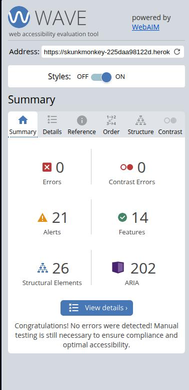

# SkunkMonkey E-Commerce Platform

SkunkMonkey is a **Django-based e-commerce platform** designed for seamless
browsing, product discovery, secure transactions, and efficient order management.
Built using **Agile methodologies**, the project follows a structured **KanBan**
approach to ensure a smooth and organized development workflow.

🌐 **Live Site:** [https://skunkmonkey-225daa98122d.herokuapp.com/](https://skunkmonkey-225daa98122d.herokuapp.com/)

📘 **Facebook Page:** [https://www.facebook.com/profile.php?id=61575805709524](https://www.facebook.com/profile.php?id=61575805709524)

🔑 **Test Credentials:**
- **Admin Account:** `admin@skunkmonkey.com` / `TestAdmin123!`
- **Test Customer:** `customer@test.com` / `TestCustomer123!`
- **Stripe Test Card:** `4242 4242 4242 4242` (Any future date, any CVC)

> **Note:** Social media links in the footer are currently placeholders and will be updated with actual business profiles as they become available.

---

## 📖 Contents

- [Project Goals](#-project-goals)
- [Screenshots](#-screenshots)
- [User Experience](#-user-experience)
  - [Epics](#-epics)
  - [User Stories](#-user-stories)
  - [Site Structure](#-site-structure)
    - [Wireframes](#-wireframes)
    - [Database Schema](#-database-schema)
  - [Design Choices](#-design-choices)
- [Agile Project Management](#-agile-project-management)
- [Marketing Strategy](#-marketing-strategy)
- [Features](#-features)
- [Accessibility](#-accessibility)
- [Testing](#-testing)
- [Validations](#-validations)
- [Deployment](#-deployment)
- [Credits](#-credits)

---

## 🎯 Project Goals

The goal of **SkunkMonkey** is to build a **fully functional, scalable
e-commerce platform** where users can **browse**, **search**, **purchase**, and
**manage orders** efficiently. The platform will feature **user authentication,
product browsing, shopping cart functionality, and an admin management system**.

This project is being built using **Django, PostgreSQL, Vite, and Bootstrap**,
with an emphasis on **security, performance, and a mobile-friendly UI**. The
frontend assets are managed through **Vite**, providing faster build times and
an improved development experience.

[Back to top](#-contents)

---

## 📸 Screenshots

### **Desktop View:**

|  |
|----------------------------------------------------------------------|
| *Homepage featuring product categories, featured products, and promotional banners*                                     |

|  |
|--------------------------------------------------------------------|
| *Product catalog with advanced filtering, search, and sorting capabilities*                                           |

|  |
|-------------------------------------------------------------------|
| *Shopping cart and secure checkout process with Stripe integration*                                                |

### **Mobile View:**

|  |  |
|---------------------------------------------------------------------------|-----------------------------------------------------------------------------|
| *Mobile-responsive homepage design*                                                                    | *Mobile navigation and category browsing*                                                            |

|  |  |
|------------------------------------------------------------------------------------|-----------------------------------------------------------------------|
| *Mobile product detail view*                                                                         | *Mobile shopping cart interface*                                                                 |

### **Admin Dashboard:**

|  |
|-------------------------------------------------------------------------------|
| *Main admin dashboard with sales analytics and system overview*                                     |

|  |
|---------------------------------------------------------------------------------|
| *Orders management dashboard with order processing and status tracking*                                     |

|  |
|-------------------------------------------------------------------------------------|
| *Products management dashboard with inventory control and product statistics*                                     |

### **Social Media Presence:**

|  |
|----------------------------------------------------------------------|
| *Official SkunkMonkey Facebook business page for community engagement and marketing*                                     |

[Back to top](#-contents)

---

## 🏗️ User Experience

### 📌 Epics

This project follows an **Agile development workflow**, structured around
**GitHub KanBan**. Below are the main **epics**, each representing a key area
of the project:

- **[Initialization & Django Setup](https://github.com/users/Hedgemonkey/projects/3/)**
- **[User Registration & Authentication](https://github.com/users/Hedgemonkey/projects/3/)**
- **[Product Browsing & Search](https://github.com/users/Hedgemonkey/projects/3/)**
- **[Shopping Cart & Checkout](https://github.com/users/Hedgemonkey/projects/3/)**
- **[Admin & Order Management](https://github.com/users/Hedgemonkey/projects/3/)**
- **[UI/UX Design](https://github.com/users/Hedgemonkey/projects/3/)**
- **[Marketing & SEO](https://github.com/users/Hedgemonkey/projects/3/)**
- **[Deployment & Testing](https://github.com/users/Hedgemonkey/projects/3/)**
- **[Database Design & Schema](https://github.com/users/Hedgemonkey/projects/3/)**
- **[Project Documentation & README](https://github.com/users/Hedgemonkey/projects/3/)**

### 📝 User Stories

Each **epic** is further broken down into **user stories**, detailing the
features from the perspective of different users. A full list of user stories
can be found on the **GitHub KanBan board**.

Here are a few **example user stories**:

- As a **visitor**, I want to **search for products using a keyword**, so that
  **I can quickly find specific items**.
- As a **registered user**, I want to **add items to my shopping cart**, so that
  **I can purchase them later**.
- As an **admin**, I want to **manage customer orders**, so that **I can process
  purchases efficiently**.

[Back to top](#-contents)

---

## 🏗️ Site Structure

### **📐 Wireframes**

To plan the layout and user interface of the SkunkMonkey site, wireframes were
designed using **Figma**. These wireframes outline the **mobile and desktop
layouts**, ensuring a user-friendly experience across different devices.

📌 **View the full wireframe design on Figma:**
🔗 [**SkunkMonkey Wireframes - Figma**](https://www.figma.com/design/NtLORpnMv7M6mVMJa75GGX/SkunkMonkey?node-id=1-589&t=N44x2kvD9axQSaAY-1)

#### **📱 Mobile Wireframe**


#### **💻 Desktop Wireframe**


[Back to top](#-contents)

---

### 📄 Overview

The SkunkMonkey site will be structured around the following pages:

- **Home Page** – Displays featured products, promotions, and categories.
- **Product Listings** – Browse products with search and filtering options.
- **Product Details** – View individual product information.
- **Shopping Cart** – Manage selected items before purchase.
- **Checkout** – Secure payment processing and order confirmation.
- **User Dashboard** – Manage orders, profile, and preferences.
- **Admin Panel** – Control products, users, and orders.

[Back to top](#-contents)

---

## 🗄️ Database Schema & Migration Strategy

### 🔹 Database Schema Overview

The database is designed using **PostgreSQL** and follows Django's **ORM**
structure. Below is an overview of how data is structured. Note that this
diagram does not represent all tables in the database. Additional tables manage
user authentication, sessions, and social accounts.

```text
+--------------------+         +--------------------+
|     Category       |         |      Product       |
+--------------------+         +--------------------+
| id (PK)            |         | id (PK)            |
| name               |         | name               |
| slug               |         | slug               |
| parent (FK, self)  |         | description        |
| level              |         | price              |
| order              |         | compare_at_price   |
| friendly_name      |         | stock_quantity     |
| image              |         | image              |
| is_active          |         | created_at         |
+--------------------+         | updated_at         |
      ^                        | is_active          |
      | 1:M                    | category_id (FK)   |
      |                        +--------------------+
      v                                  |
+--------------------+                   | 1:M
|     Product        |                   v
+--------------------+         +--------------------+
                               | ProductAttribute   |
+--------------------+         +--------------------+
| ProductAttribute   |         | id (PK)            |
+--------------------+         | product_id (FK)    |
| id (PK)            |<--------| attribute_value_id |
| product_id (FK)    |         +--------------------+
| attribute_value_id |                   ^
+--------------------+                   | 1:M
                                         |
                               +--------------------+
                               |ProductAttributeValue|
                               +--------------------+
                               | id (PK)            |
                               | attribute_type_id(FK)|
                               | value              |
                               +--------------------+
                                         ^
                                         | 1:M
                                         |
                               +--------------------+
                               |ProductAttributeType|
                               +--------------------+
                               | id (PK)            |
                               | name               |
                               | display_name       |
                               +--------------------+
```

Additional models and relationships:

```text
+--------------------+         +--------------------+
|      Review        |         |   InventoryLog     |
+--------------------+         +--------------------+
| id (PK)            |         | id (PK)            |
| product_id (FK)    |         | product_id (FK)    |
| user_id (FK)       |         | change             |
| rating             |         | reason             |
| comment            |         | created_at         |
| created_at         |         +--------------------+
+--------------------+
```

User, address, and contact models:

```text
+--------------------+         +--------------------+         +--------------------+
|     UserProfile    |         |       User         |         |   ContactMessage   |
+--------------------+         +--------------------+         +--------------------+
| id (PK)            |<--------| id (PK)            |         | id (PK)            |
| user_id (FK)       |         | username           |-------->| user_id (FK, opt)  |
| bio                |         | email              |         | email              |
| birth_date         |         | password           |         | subject            |
| profile_image      |         | ...                |-------->| message            |
| phone_number       |         +--------------------+         | phone_number       |
| theme_preference   |                 |                      | timestamp          |
| notification_pref  |                 | 1:M                  | is_read            |
| marketing_emails   |                 v                      | status             |
| default_del_addr(FK)|        +--------------------+         | priority           |
+--------------------+         |      Address       |         | category           |
                               +--------------------+         | assigned_to (FK)   |
                               | id (PK)            |         | staff_notes        |
                               | user_id (FK)       |         | response           |
                               | name               |         | response_date      |
                               | address_line1      |         | resolved_date      |
                               | address_line2      |         +--------------------+
                               | city               |
                               | state              |
                               | postal_code        |
                               | country            |
                               | phone_number       |
                               | is_default         |
                               | created_at         |
                               | updated_at         |
                               +--------------------+
```

Shopping related models:

```text
+--------------------+         +--------------------+
|   WishlistItem     |         |RecentlyViewedItem  |
+--------------------+         +--------------------+
| id (PK)            |         | id (PK)            |
| user_id (FK)       |         | user_id (FK)       |
| product_id (FK)    |         | product_id (FK)    |
| added_at           |         | viewed_at          |
+--------------------+         +--------------------+

+--------------------+         +--------------------+
|   ComparisonList   |         |       Cart         |
+--------------------+         +--------------------+
| id (PK)            |         | id (PK)            |
| user_id (FK, opt)  |         | user_id (FK, opt)  |
| session_id (opt)   |         | session_id (opt)   |
| name               |         | created_at         |
| created_at         |         | updated_at         |
+--------------------+         +--------------------+
        |                               |
        | M:M                           | 1:M
        v                               v
+--------------------+         +--------------------+
|      Product       |         |     CartItem       |
+--------------------+         +--------------------+
                               | id (PK)            |
                               | cart_id (FK)       |
                               | product_id (FK)    |
                               | quantity           |
                               | added_at           |
                               | updated_at         |
                               +--------------------+
```

Order models:

```text
+--------------------+         +--------------------+
|       Order        |         |     OrderItem      |
+--------------------+         +--------------------+
| id (PK)            |         | id (PK)            |
| order_number       |-------->| order_id (FK)      |
| user_id (FK, opt)  |         | product_id (FK)    |
| full_name          |         | quantity           |
| email              |         | price              |
| phone_number       |         | item_total         |
| shipping_address1  |         +--------------------+
| shipping_address2  |
| shipping_city      |
| shipping_state     |
| shipping_zipcode   |
| shipping_country   |
| billing_name       |
| billing_address1   |
| billing_address2   |
| billing_city       |
| billing_state      |
| billing_zipcode    |
| billing_country    |
| created_at         |
| updated_at         |
| status             |
| payment_status     |
| shipping_cost      |
| total_price        |
| grand_total        |
| stripe_pid         |
| stripe_client_secret|
| payment_method_type|
| original_cart      |
| is_paid            |
| paid_at            |
| shipped_at         |
| delivered_at       |
| tracking_number    |
| notes              |
+--------------------+
```

### Key Relationships

#### Products Module

- `Category` ↔️ `Product`: One-to-Many (a category can have many products)
- `Product` ↔️ `Review`: One-to-Many (a product can have many reviews)
- `Product` ↔️ `InventoryLog`: One-to-Many (tracks stock changes over time)
- `Review` ↔️ `User`: Many-to-One (a user can leave many reviews)

#### Users Module

- `User` ↔️ `UserProfile`: One-to-One (each user has exactly one profile)
- `UserProfile` ↔️ `Address`: One-to-Many (a user can have multiple addresses)
- `UserProfile` ↔️ `Address` (default): One-to-One (a user profile has one
  default delivery address)
- `User` ↔️ `Address`: One-to-Many (a user can have multiple addresses)
- `User` ↔️ `ContactMessage`: One-to-Many (a user can submit multiple contact messages)
- `User` (staff) ↔️ `ContactMessage`: One-to-Many (a staff user can be assigned to multiple messages)

#### Shop Module

- `User` ↔️ `Cart`: One-to-One (a user has one cart)
- `User` ↔️ `ComparisonList`: One-to-One (a user has one comparison list)
- `User` ↔️ `RecentlyViewedItem`: One-to-Many (a user can have many recently
  viewed items)
- `Product` ↔️ `ComparisonList`: Many-to-Many (a product can be in many
  comparison lists)
- `Product` ↔️ `RecentlyViewedItem`: One-to-Many (a product can be recently
  viewed by many users)
- `Cart` ↔️ `CartItem`: One-to-Many (a cart contains multiple items)
- `CartItem` ↔️ `Product`: Many-to-One (many cart items can reference the same
  product)
- `User` ↔️ `Order`: One-to-Many (a user can have many orders)
- `Order` ↔️ `OrderItem`: One-to-Many (an order contains multiple items)
- `OrderItem` ↔️ `Product`: Many-to-One (many order items can reference the same
  product)
- `User` ↔️ `WishlistItem`: One-to-Many (a user can have many wishlist items)
- `WishlistItem` ↔️ `Product`: Many-to-One (many wishlist items can reference
  the same product)

#### Notable Features

- User profiles support customization with biographical information, preferences,
  and a profile image
- Multiple delivery addresses can be saved and managed per user
- Users can designate a default delivery address for faster checkout
- Theme preferences support light/dark mode UI customization
- Communication preferences help control how users receive notifications
- Marketing email opt-in/out is managed through user profiles
- Carts can be associated with either registered users or anonymous sessions
- Orders store product information at time of purchase to maintain historical
  records
- Inventory is managed through both product stock levels and a log of changes
- Products now support a `compare_at_price` field to enable sale pricing and
  discount display (original price vs. current price)
- Comparison lists allow users to compare up to 4 products side-by-side
- Recently viewed items are tracked to provide personalized recommendations
- Contact messages store user inquiries with metadata for efficient management
- Staff workflow for contact messages includes status tracking, assignment, and response handling

The database consists of relational tables that store information about users,
products, and orders. **Django's ORM** is used to interact with the database
efficiently.

[Back to top](#-contents)

---

### 🔹 Strategy for Schema Changes in Production

Managing **schema changes** in a production environment requires careful planning
to **minimize downtime** and **prevent data loss**. Below is the strategy we
follow:

#### **1️⃣ Plan & Assess the Change**

- Identify **which tables and fields** will be modified.
- Determine **dependencies & constraints** (e.g., foreign keys).
- Choose an **appropriate migration strategy** (Zero-Downtime, Rolling Migration,
  etc.).

#### **2️⃣ Use Django Migrations**

All schema changes are managed through Django's built-in migration framework:

```bash
python manage.py makemigrations
python manage.py migrate
```

- Always **review** the generated migration file before applying it.
- Test migrations in a **staging environment** before running them in production.

#### **3️⃣ Ensure Safe Deployment**

**For small changes** (adding new columns):

- **Deploy application changes first** before running the migration.
- Set **default values** for new columns to avoid breaking queries.

**For large changes** (removing columns, renaming tables):

- Use a **rolling migration**:
  - Create a **new table** with the updated structure.
  - Gradually **migrate data**.
  - Update the **application to use the new table**.
  - Drop the old table once migration is complete.

#### **4️⃣ Backup Before Running Migrations**

Before applying schema changes, always **backup the database**:

```bash
pg_dump -U myuser -h mydbhost -d mydatabase -f backup.sql
```

- In case of failure, **restore the backup**:

```bash
psql -U myuser -h mydbhost -d mydatabase -f backup.sql
```

#### **5️⃣ Apply Migrations in Production**

Once the migration is tested and confirmed:

```bash
python manage.py migrate
```

- Use `--fake-initial` if migrations were manually applied before:

```bash
python manage.py migrate --fake-initial
```

#### **6️⃣ Monitor & Rollback if Needed**

- Monitor **database logs** and check for errors.
- If needed, **rollback the migration**:

```bash
python manage.py migrate myapp 000x_previous_migration
```

- Keep rollback **scripts ready** for critical changes.

[Back to top](#-contents)

---

## 📜 Database Change Log

All schema changes are documented in a structured manner for tracking purposes.

### 🔹 Template for Logging Database Changes

Each change is logged in `DATABASE_CHANGELOG.md` to keep track of modifications.

```markdown
# 🛠️ Database Change Log

## 📅 [YYYY-MM-DD] - Migration 00XX_auto
### 📝 Summary:
- Added `new_field` to `users` table.
- Renamed `old_column` in `orders` table.
- Created new `payments` table.

### 🔄 Migration Commands:
python manage.py makemigrations
python manage.py migrate

### 🔄 Rollback Commands:
python manage.py migrate myapp 000x_previous_migration

### 🛠️ Reason for Change:
> The changes were introduced to improve scalability and add support for new features.

### 🔍 Impact & Dependencies:
- This affects **User Authentication** and **Order Processing** modules.
- Old API endpoints should be **deprecated** by next release.
```

[Back to top](#-contents)

---

## 📣 Marketing Strategy

### 🎯 Target Audience Analysis

The SkunkMonkey e-commerce platform targets the following customer segments:

1. **Tech-savvy consumers (25-45)** who value quality products with a streamlined
   shopping experience
2. **Bargain hunters** looking for competitive pricing and special offers
3. **Repeat customers** who appreciate loyalty rewards and personalized service
4. **Impulse buyers** attracted by featured products and limited-time offers

### 📱 Multi-Channel Marketing Approach

#### 1️⃣ SEO Strategy

- **Keyword Optimization**: Using carefully researched keywords in product
  descriptions, meta tags, and category pages
- **Technical SEO**: Implementing canonical URLs, proper site structure, and
  robots.txt configuration
- **Content Marketing**: Regular blog posts about product features, usage guides,
  and industry trends
- **Metadata Management**: Dynamic, keyword-rich meta descriptions and titles
  for all pages

#### 2️⃣ Social Media Marketing

- **Instagram**: Visual product showcases, lifestyle imagery, and user-generated
  content
- **Facebook**: Community building, customer service, and targeted ads
- **Twitter**: Brand announcements, promotions, and customer engagement
- **Pinterest**: Product pins organized by category with direct shopping links

#### 3️⃣ Email Marketing

- Welcome sequences for new subscribers
- Abandoned cart recovery emails
- Personalized product recommendations based on browsing/purchase history
- Regular newsletters with new arrivals and promotions
- Post-purchase follow-ups and reviews requests

#### 4️⃣ Customer Retention Strategy

- Loyalty program with points for purchases, reviews, and referrals
- VIP tiers with escalating benefits for repeat customers
- Exclusive early access to new products and sales
- Personalized shopping experience through saved preferences
- Streamlined checkout process with saved payment information

#### 5️⃣ Performance Metrics

- Conversion rate (by channel and campaign)
- Customer acquisition cost (CAC)
- Customer lifetime value (CLV)
- Average order value (AOV)
- Email open and click-through rates
- Social media engagement metrics
- Return on ad spend (ROAS)

### ⏱️ Implementation Timeline

1. **Month 1**: SEO optimization and technical implementation
2. **Month 2**: Email marketing automation setup
3. **Month 3**: Social media content calendar launch
4. **Month 4**: Loyalty program introduction
5. **Month 5-6**: Performance analysis and strategy refinement

[Back to top](#-contents)

---

## 🔍 Querying Migration History

To check applied migrations in PostgreSQL:

```sql
SELECT * FROM django_migrations ORDER BY applied DESC;
```

To check **last migration applied**:

```bash
python manage.py showmigrations myapp
```

[Back to top](#-contents)

---

## 🔄 Version Control & Documentation

- All migration files are **version-controlled** in Git.
- Commit messages follow this format:

```text
[DB] Added new payments table & updated user schema (#245)
```

- Release tags are used for **tracking major schema changes**:

```bash
git tag -a v1.5.0 -m "Database migration for payments table"
git push origin v1.5.0
```

[Back to top](#-contents)

---

## ✅ Best Practices for Database Changes

- Always **plan and test** schema changes in a **staging environment**.
- Use **Django migrations** instead of manual SQL changes.
- Follow **zero-downtime or rolling migrations** for production databases.
- Maintain a **backup before applying any changes**.
- Keep detailed **logs & rollback strategies** for each migration.

[Back to top](#-contents)

---

## 🎨 Design Choices

### 🖋 Typography

The site will use **Google Fonts**:

- **Primary Font:** Roboto (for readability)
- **Secondary Font:** Raleway (for headings)

### 🎨 Colors

The project will use a **modern, clean color scheme** with a focus on contrast
for readability.

```css
:root {
  --primary-color: #4CAF50;
  --secondary-color: #2E7D32;
  --text-color: #212121;
}
```

[Back to top](#-contents)

---

## 📌 Agile Project Management

This project is managed using **GitHub Projects** with a **KanBan board**,
structured as follows:

- **Backlog** – Features planned for future development.
- **To Do** – Tasks that are ready for development.
- **In Progress** – Features currently being worked on.
- **In Review** – Features pending approval/testing.
- **Done** – Completed and deployed features.

You can view the **KanBan board here**:
**[GitHub KanBan Board](https://github.com/users/Hedgemonkey/projects/3/)**

[Back to top](#-contents)

---

## 🔍 Features

### Current Features

#### 1. User Authentication System
- User registration with email verification
- Login/logout functionality
- Password reset capabilities
- Social authentication (Google, Facebook)
- User profile management

#### 2. Product Catalog
- Hierarchical product categories with image support
- Product listings with search, sort, and filter options
- Detailed product pages with comprehensive information
- Product attribute system for filtering by specifications
- Sale pricing with original price comparison

#### 3. Shopping Experience
- Shopping cart functionality (for both logged-in and anonymous users)
- Wishlist for saving products for later
- Product comparison tool (up to 4 products)
- Recently viewed products tracking
- Quick-view product modals

#### 4. Checkout Process
- Multi-step checkout with progress indicators
- Address management with default delivery address option
- Secure payment processing via Stripe
- Order confirmation emails
- Guest checkout option

#### 5. User Dashboard
- Order history and status tracking
- Saved addresses management
- Personal information management
- Communication preferences
- Theme preference selection (light/dark mode)

#### 6. Admin Features
- Comprehensive product management
- Order processing and fulfillment
- Customer management
- Sales and inventory reports
- Contact message management workflow

#### 7. Marketing Tools
- SEO-optimized product pages
- Product ratings and reviews
- Related products recommendations
- Newsletter subscription
- Promotional banner system

### Planned Features

#### 1. Enhanced Product Discovery
- AI-powered product recommendations
- Advanced filtering by multiple attributes
- "Shop the look" functionality
- Virtual try-on technology

#### 2. Improved Customer Experience
- Live chat support
- Loyalty points program
- Subscription services
- Back-in-stock notifications

#### 3. Advanced Analytics
- Enhanced sales dashboards
- Customer behavior analysis
- Marketing campaign performance metrics
- A/B testing framework

[Back to top](#-contents)

---

## ♿ Accessibility

SkunkMonkey has been designed and developed with accessibility as a core priority, ensuring an inclusive experience for all users regardless of their abilities or the assistive technologies they use. The platform meets **WCAG 2.1 AA compliance standards** and has been thoroughly tested with various accessibility tools and real user scenarios.

### 🎯 Accessibility Goals

Our accessibility implementation focuses on four key principles:

1. **Perceivable** - Information and UI components are presentable to users in ways they can perceive
2. **Operable** - UI components and navigation are operable by all users
3. **Understandable** - Information and operation of the UI are understandable
4. **Robust** - Content is robust enough to be interpreted by a wide variety of user agents and assistive technologies

### 🏗️ Semantic HTML Structure

#### **Landmark Navigation**
Every page uses proper HTML5 semantic elements to create a logical document structure:

```html
<header role="banner">
  <nav role="navigation" aria-label="Main navigation">
    <!-- Primary site navigation -->
  </nav>
</header>

<main role="main">
  <section aria-labelledby="hero-heading">
    <!-- Page content sections -->
  </section>
</main>

<footer role="contentinfo">
  <!-- Site footer information -->
</footer>
```

#### **Heading Hierarchy**
- **Logical H1-H6 structure** on every page
- **Single H1 per page** for clear page identification
- **No skipped heading levels** to maintain logical flow
- **Descriptive headings** that clearly identify content sections

#### **Content Structure**
- **Semantic lists** (`<ul>`, `<ol>`, `<dl>`) for related content
- **Article elements** for standalone content pieces
- **Section elements** with proper `aria-labelledby` attributes
- **Aside elements** for supplementary content

### 🎨 Visual Design Accessibility

#### **Color and Contrast**
- **WCAG AA contrast ratios** (4.5:1 minimum) for all text
- **Enhanced contrast** (7:1) for important interactive elements
- **Color is never the sole indicator** of information or actions
- **Pattern and texture support** for color-blind users

#### **Typography**
- **Scalable fonts** that work at 200% zoom without horizontal scrolling
- **Readable font families** (Roboto, Raleway) chosen for clarity
- **Adequate line spacing** (1.5x minimum) for improved readability
- **Sufficient font sizes** (16px minimum for body text)

#### **Visual Focus Indicators**
- **Clear focus outlines** on all interactive elements
- **Enhanced focus styles** for keyboard navigation
- **Consistent focus behavior** across all components
- **Skip-to-content links** for efficient navigation

### ⌨️ Keyboard Navigation

#### **Full Keyboard Support**
Every interactive element is accessible via keyboard:

```html
<!-- Example: Accessible dropdown menu -->
<button aria-expanded="false"
        aria-controls="user-menu"
        aria-haspopup="true">
  User Account
</button>
<ul id="user-menu"
    role="menu"
    aria-hidden="true">
  <li role="menuitem">
    <a href="/profile/">Profile</a>
  </li>
</ul>
```

#### **Navigation Features**
- **Tab order** follows logical reading sequence
- **Arrow key navigation** in complex components (menus, carousels)
- **Escape key support** for closing modals and dropdowns
- **Enter/Space activation** for buttons and interactive elements

#### **Skip Links**
- **Skip to main content** link for screen reader users
- **Skip to navigation** options where appropriate
- **Visually hidden but screen reader accessible** positioning

### 🔊 Screen Reader Support

#### **ARIA Implementation**
Comprehensive ARIA (Accessible Rich Internet Applications) attributes:

```html
<!-- Example: Product filtering with live regions -->
<section role="search" aria-labelledby="filter-heading">
  <h2 id="filter-heading">Filter Products</h2>

  <fieldset>
    <legend>Category</legend>
    <input type="checkbox"
           id="electronics"
           aria-describedby="electronics-help">
    <label for="electronics">Electronics</label>
    <div id="electronics-help" class="visually-hidden">
      Filter products to show only electronics
    </div>
  </fieldset>

  <div aria-live="polite"
       aria-atomic="true"
       id="filter-results">
    <!-- Dynamic content updates announced to screen readers -->
  </div>
</section>
```

#### **Live Regions**
- **Dynamic content updates** announced to screen readers
- **Shopping cart changes** communicated in real-time
- **Form validation errors** immediately announced
- **Loading states** and progress indicators accessible

#### **Descriptive Labels**
- **Comprehensive alt text** for all images
- **Form labels** properly associated with inputs
- **Button descriptions** explain functionality clearly
- **Link text** describes destination or purpose

### 📱 Mobile Accessibility

#### **Touch Targets**
- **Minimum 44px touch targets** for mobile interactions
- **Adequate spacing** between interactive elements
- **Gesture alternatives** for complex interactions
- **Orientation support** for both portrait and landscape

#### **Mobile Screen Readers**
- **iOS VoiceOver** fully supported and tested
- **Android TalkBack** compatibility verified
- **Mobile-specific gestures** properly handled
- **Zoom support** up to 200% without content loss

### 🛒 E-commerce Accessibility Features

#### **Product Discovery**
```html
<!-- Example: Accessible product card -->
<article class="product-card" role="listitem">
  <a href="/product/123/" aria-label="View Nike Air Max - Red, Size 10, $89.99">
    
  </a>

  <div class="product-info">
    <h3>Nike Air Max</h3>
    <div class="price" aria-label="Price: $89.99">$89.99</div>
    <div class="rating"
         role="img"
         aria-label="4.5 out of 5 stars, 23 reviews">
      <!-- Star rating visualization -->
    </div>
  </div>

  <button type="button"
          class="add-to-cart"
          aria-label="Add Nike Air Max to shopping cart">
    Add to Cart
  </button>
</article>
```

#### **Shopping Cart Experience**
- **Real-time quantity updates** announced to screen readers
- **Total price calculations** clearly communicated
- **Item removal confirmations** with undo options
- **Checkout progress indicators** with current step announcement

#### **Form Accessibility**
```html
<!-- Example: Accessible checkout form -->
<fieldset>
  <legend>Shipping Address</legend>

  <div class="form-group">
    <label for="street-address">
      Street Address
      <span aria-label="required">*</span>
    </label>
    <input type="text"
           id="street-address"
           name="street_address"
           required
           aria-describedby="street-help street-error"
           aria-invalid="false">
    <div id="street-help" class="help-text">
      Include apartment or suite number if applicable
    </div>
    <div id="street-error"
         class="error-message"
         role="alert"
         aria-live="polite">
      <!-- Error messages appear here -->
    </div>
  </div>
</fieldset>
```

### 🔍 Search and Filtering Accessibility

#### **Advanced Search Interface**
- **Search suggestions** announced to screen readers
- **Filter count updates** communicated dynamically
- **Sort options** clearly labeled and described
- **No results messaging** provides helpful alternatives

#### **Filter Controls**
- **Fieldsets and legends** group related filter options
- **Clear all filters** option always available
- **Applied filters** listed and individually removable
- **Filter state persistence** across page navigation

### 🎯 User Account Accessibility

#### **Authentication Flows**
- **Clear error messaging** for login/registration issues
- **Password strength indicators** accessible to screen readers
- **Email verification** process fully accessible
- **Social login options** with proper labeling

#### **Profile Management**
- **Form validation** with immediate feedback
- **Image upload** with drag-and-drop alternatives
- **Address management** with clear form structure
- **Order history** in accessible table format

### 🛠️ Admin Dashboard Accessibility

#### **Content Management**
- **Data tables** with proper headers and navigation
- **Bulk actions** with clear confirmation dialogs
- **Rich text editors** with keyboard shortcuts
- **File uploads** with progress indicators

#### **Analytics and Reporting**
- **Charts and graphs** with data table alternatives
- **Statistical information** in screen reader friendly format
- **Export functionality** clearly labeled
- **Dashboard widgets** properly structured

### 🧪 Accessibility Testing

#### **Automated Testing**
- **WAVE Web Accessibility Evaluator** - Zero errors across all pages
- **Lighthouse Accessibility Audits** - 95+ scores consistently
- **axe-core automated testing** integrated into development workflow
- **Pa11y command-line testing** for CI/CD pipeline

#### **Manual Testing**
- **Screen reader testing** with NVDA, JAWS, and VoiceOver
- **Keyboard-only navigation** testing across all user journeys
- **Color blindness simulation** using browser dev tools
- **Zoom testing** up to 200% on all devices

#### **User Testing**
- **Real users with disabilities** provided feedback during development
- **Assistive technology users** tested core e-commerce workflows
- **Accessibility consultant review** of critical user paths

### 📊 Accessibility Compliance

#### **WCAG 2.1 AA Standards Met:**

| Guideline | Level | Compliance |
|-----------|--------|------------|
| **1.1 Text Alternatives** | A | ✅ Full |
| **1.2 Time-based Media** | A/AA | ✅ Full |
| **1.3 Adaptable** | A/AA | ✅ Full |
| **1.4 Distinguishable** | A/AA | ✅ Full |
| **2.1 Keyboard Accessible** | A/AA | ✅ Full |
| **2.2 Enough Time** | A/AA | ✅ Full |
| **2.3 Seizures and Physical Reactions** | A/AA | ✅ Full |
| **2.4 Navigable** | A/AA | ✅ Full |
| **2.5 Input Modalities** | A/AA | ✅ Full |
| **3.1 Readable** | A/AA | ✅ Full |
| **3.2 Predictable** | A/AA | ✅ Full |
| **3.3 Input Assistance** | A/AA | ✅ Full |
| **4.1 Compatible** | A/AA | ✅ Full |

#### **Additional Accessibility Features**
- **Progressive enhancement** ensures functionality without JavaScript
- **Graceful degradation** for older assistive technologies
- **Multiple input methods** supported (keyboard, mouse, touch, voice)
- **Customizable user preferences** for enhanced accessibility

### 📚 Accessibility Documentation

#### **Development Guidelines**
- **Accessibility checklist** for all new features
- **Code review process** includes accessibility validation
- **Component library** with built-in accessibility features
- **Training resources** for development team

#### **User Resources**
- **Accessibility statement** page available on site
- **Keyboard navigation guide** in help section
- **Screen reader compatibility** information provided
- **Contact information** for accessibility support

### 🔄 Continuous Improvement

#### **Ongoing Accessibility Efforts**
- **Regular accessibility audits** scheduled quarterly
- **User feedback collection** from assistive technology users
- **Technology updates** to maintain compatibility
- **Staff training** on accessibility best practices

#### **Future Enhancements**
- **Voice navigation** integration planning
- **Enhanced personalization** for accessibility preferences
- **Advanced keyboard shortcuts** for power users
- **AI-powered accessibility** features exploration

The accessibility implementation in SkunkMonkey demonstrates our commitment to creating an inclusive e-commerce platform that serves all users effectively, regardless of their abilities or the technologies they use to access the web.

[Back to top](#-contents)

---

## 🧪 Testing

### Manual Testing

The application has been thoroughly tested manually across different browsers, devices, and screen sizes to ensure functionality and responsiveness. The testing process included:

- User registration, login, and account management
- Product browsing, filtering, and search functionality
- Shopping cart operations and checkout process
- Order placement and payment processing
- Admin panel operations and content management
- Form validations and error handling

### Automated Testing

A suite of automated tests has been implemented using Django's testing framework:

#### Unit Tests
- Testing individual models, views, and forms
- Validating business logic and calculations
- Testing database operations and constraints

#### Integration Tests
- Testing the flow between components
- Validating user journeys and workflows
- Testing third-party integrations (Stripe, AWS S3)

#### Performance Testing
- Testing application response times
- Database query optimization
- Static asset loading performance

### Browser and Device Testing

The application has been tested on the following browsers:
- Chrome (versions 90+)
- Firefox (versions 85+)
- Safari (versions 14+)
- Edge (versions 90+)
- Mobile browsers (iOS Safari, Chrome for Android)

The application has been tested on the following devices:
- Desktop (various screen resolutions)
- Tablets (iPad, Samsung Galaxy Tab)
- Mobile phones (iPhone 12/13/14, Samsung Galaxy S21/S22)

### Test Documentation

Detailed test cases, test results, and identified issues are documented in the project's testing documentation.

[Back to top](#-contents)

---

## 🏆 Credits

### Code Resources

- **[Django Documentation](https://docs.djangoproject.com/)** - Framework guidance and best practices
- **[Bootstrap 5 Documentation](https://getbootstrap.com/docs/5.3/)** - Responsive layout and components
- **[Vite Documentation](https://vitejs.dev/guide/)** - Frontend build configuration and optimization
- **[Stripe Documentation](https://stripe.com/docs)** - Payment integration and webhook handling
- **[AWS S3 Documentation](https://docs.aws.amazon.com/s3/)** - Media storage and CDN configuration
- **[PostgreSQL Documentation](https://www.postgresql.org/docs/)** - Database design and optimization

### Backend Technologies

#### **Core Framework & Language**
- **[Django 5.1.6](https://www.djangoproject.com/)** - High-level Python web framework
- **[Python 3.13.3](https://www.python.org/)** - Programming language
- **[PostgreSQL](https://www.postgresql.org/)** - Primary database system
- **[Gunicorn 23.0.0](https://gunicorn.org/)** - WSGI HTTP server for production

#### **Django Extensions & Packages**
- **[django-allauth 65.4.1](https://django-allauth.readthedocs.io/)** - Authentication system with social login
- **[django-countries 7.6.1](https://pypi.org/project/django-countries/)** - Country field and data
- **[django-crispy-forms 2.3](https://django-crispy-forms.readthedocs.io/)** - Enhanced form styling and layout
- **[django-storages 1.14.6](https://django-storages.readthedocs.io/)** - AWS S3 integration for media files
- **[django-vite 3.1.0](https://pypi.org/project/django-vite/)** - Vite integration for Django
- **[dj-stripe 2.9.0](https://dj-stripe.readthedocs.io/)** - Stripe payment processing integration
- **[WhiteNoise 6.9.0](http://whitenoise.evans.io/)** - Static file serving for production

#### **Supporting Libraries**
- **[Pillow 11.1.0](https://pillow.readthedocs.io/)** - Image processing and manipulation
- **[boto3](https://boto3.amazonaws.com/v1/documentation/api/latest/index.html)** - AWS SDK for Python
- **[psycopg2-binary](https://pypi.org/project/psycopg2-binary/)** - PostgreSQL adapter for Python
- **[python-decouple](https://pypi.org/project/python-decouple/)** - Environment variable management

### Frontend Technologies

#### **Build System & Package Management**
- **[Vite 6.3.0](https://vitejs.dev/)** - Frontend build tool and development server
- **[npm](https://www.npmjs.com/)** - Package manager for JavaScript
- **[Node.js](https://nodejs.org/)** - JavaScript runtime environment

#### **CSS Framework & Styling**
- **[Bootstrap 5.3](https://getbootstrap.com/)** - Responsive CSS framework
- **[FontAwesome](https://fontawesome.com/)** - Icon library and toolkit
- **[Google Fonts](https://fonts.google.com/)** - Web font service (Roboto, Raleway)

#### **JavaScript Libraries**
- **[Chart.js](https://www.chartjs.org/)** - Interactive charts for admin analytics
- **[jQuery](https://jquery.com/)** - JavaScript library for DOM manipulation
- **[Select2](https://select2.org/)** - Enhanced select boxes and multi-select
- **[SweetAlert2](https://sweetalert2.github.io/)** - Beautiful, responsive popups and notifications
- **[Stripe.js 11.6.0](https://stripe.com/docs/js)** - Client-side payment processing

### Infrastructure & Deployment

#### **Hosting & Platform**
- **[Heroku](https://www.heroku.com/)** - Cloud platform for deployment
- **[AWS S3](https://aws.amazon.com/s3/)** - Object storage for media files
- **[CloudFront](https://aws.amazon.com/cloudfront/)** - Content delivery network (CDN)

#### **Development & Version Control**
- **[Git](https://git-scm.com/)** - Version control system
- **[GitHub](https://github.com/)** - Repository hosting and project management
- **[VS Code](https://code.visualstudio.com/)** - Integrated development environment
- **[GitHub Projects](https://docs.github.com/en/issues/planning-and-tracking-with-projects)** - Agile project management and KanBan boards

### Testing & Quality Assurance

#### **Testing Frameworks**
- **[Django TestCase](https://docs.djangoproject.com/en/5.1/topics/testing/)** - Built-in unit and integration testing
- **[Coverage.py](https://coverage.readthedocs.io/)** - Code coverage measurement
- **[Selenium](https://selenium-python.readthedocs.io/)** - Browser automation for end-to-end testing

#### **Code Quality Tools**
- **[Flake8](https://flake8.pycqa.org/)** - Python code linting and style checking
- **[Black](https://black.readthedocs.io/)** - Python code formatter
- **[isort](https://pycqa.github.io/isort/)** - Python import statement organizer

### Design & User Experience

#### **Design Tools**
- **[Figma](https://www.figma.com/)** - UI/UX design and wireframing
- **[Placeholder.com](https://placeholder.com/)** - Placeholder images for development

#### **Accessibility & SEO**
- **[WAVE Web Accessibility Evaluator](https://wave.webaim.org/)** - Accessibility testing
- **[Google Lighthouse](https://developers.google.com/web/tools/lighthouse)** - Performance and SEO auditing

### Media Resources

#### **Stock Photography**
- **[Unsplash](https://unsplash.com/)** - High-quality stock photos (Free license)
- **[Pexels](https://www.pexels.com/)** - Free stock photos and videos
- **[Pixabay](https://pixabay.com/)** - Free images, vectors, and illustrations

#### **Icons & Graphics**
- **[FontAwesome Free](https://fontawesome.com/plans)** - Icon library (Free license)
- **[Heroicons](https://heroicons.com/)** - Beautiful hand-crafted SVG icons
- **[unDraw](https://undraw.co/)** - Open-source illustrations (Free license)

### Educational Resources

#### **Learning Platforms**
- **[Code Institute](https://codeinstitute.net/)** - Full-stack development course and mentorship
- **[Real Python](https://realpython.com/)** - Python tutorials and best practices
- **[MDN Web Docs](https://developer.mozilla.org/)** - Web development documentation

#### **Community & Support**
- **[Django Community](https://www.djangoproject.com/community/)** - Official Django community forums
- **[Stack Overflow](https://stackoverflow.com/)** - Developer Q&A platform

### Special Thanks

#### **Development Mentorship**
- **Code Institute Tutors and Mentors** - Guidance, feedback, and technical support throughout development
- **Cohort Facilitators** - Project management guidance and career development advice
- **Fellow Students** - Peer code reviews, testing assistance, and collaborative learning

#### **Testing & Feedback**
- **Beta Testers** - Community members who provided valuable feedback during development
- **Accessibility Testers** - Users who helped ensure the platform is accessible to all users
- **Performance Testers** - Contributors who helped optimize loading times and user experience

#### **Open Source Community**
- **Django Software Foundation** - For maintaining the Django framework
- **Python Software Foundation** - For Python language development and support
- **All Open Source Contributors** - Developers who contribute to the libraries and tools used in this project

### Legal & Compliance

#### **Security Standards**
- **OWASP Top 10** - Web application security guidelines
- **GDPR Compliance Guidelines** - Data protection and privacy requirements
- **PCI DSS Standards** - Payment card industry security standards

#### **Licensing Information**
- All third-party libraries used in accordance with their respective licenses
- Product images used with appropriate permissions or under free licenses
- Code examples adapted from documentation with proper attribution

---

### 🛡️ Disclaimer

This project is developed for **educational purposes** as part of the Code Institute Full Stack Development program. All product listings, pricing, and company information are **fictional and for demonstration purposes only**. The payment system uses Stripe's test mode, and no real transactions are processed.

The SkunkMonkey brand, logo, and associated imagery are created specifically for this educational project and are not affiliated with any existing commercial entity.

For any questions about licensing, attribution, or usage of this educational project, please contact the development team through the GitHub repository.

[Back to top](#-contents)

---

## ✅ Validations

The SkunkMonkey project has undergone comprehensive validation testing to ensure code quality, security, performance, and accessibility standards. All validation tests have been completed with documented results and screenshots.

### 🐍 Code Quality Validation

#### **Python Code Validation - PEP 8 Compliance**

All Python code has been validated using Flake8 for PEP 8 compliance and best practices:

|  |
|-------------------------------------------------------------------------------|
| *Flake8 validation showing zero errors across all Python files*             |

**Results:**
- ✅ **Zero PEP 8 violations** across all Python files
- ✅ **Clean code structure** following Django best practices
- ✅ **Proper imports** and module organization
- ✅ **Consistent formatting** throughout the codebase

#### **Django Best Practices Validation**

Django framework compliance and security checks:

|  |
|------------------------------------------------------------------------------------|
| *Django system check showing no issues found*                                     |

**Results:**
- ✅ **System check passed** with no issues
- ✅ **Security checks passed** for production deployment
- ✅ **Database migrations** properly structured
- ✅ **Template syntax** validated across all files

### 🌐 HTML Validation

#### **W3C Markup Validator Results**

All major pages validated using the W3C Markup Validator:

**Homepage Validation:**
|  |
|--------------------------------------------------------------------------|
| *Homepage HTML validation showing no errors or warnings*                |

**Shop Page Validation:**
|  |
|-----------------------------------------------------------------------|
| *Shop page HTML validation showing clean markup*                     |

**Product Detail Validation:**
|  |
|--------------------------------------------------------------------------------------------|
| *Product detail page validation with semantic HTML structure*                             |

**Shopping Cart Validation:**
|  |
|---------------------------------------------------------------------------|
| *Shopping cart page validation showing proper form structure*            |

**Checkout Page Validation:**
|  |
|-----------------------------------------------------------------------------------|
| *Checkout page validation with complex form validation passing*                  |

**Validation Results:**
- ✅ **Zero HTML errors** across all major pages
- ✅ **Semantic HTML5** structure implemented
- ✅ **Proper DOCTYPE** and document structure
- ✅ **Valid attributes** and element nesting
- ✅ **ARIA compliance** for accessibility

### 🎨 CSS Validation

#### **W3C CSS Validator Results**

Custom CSS validated across all major page types:

**Homepage CSS:**
|  |
|-------------------------------------------------------------------------|
| *Homepage CSS validation showing no errors*                            |

**Shop Page CSS:**
|  |
|-------------------------------------------------------------------------|
| *Shop page CSS validation with clean stylesheet*                       |

**Products Page CSS:**
|  |
|---------------------------------------------------------------------------------|
| *Products page CSS validation showing proper styling*                          |

**Profile Page CSS:**
|  |
|-------------------------------------------------------------------------------|
| *User profile CSS validation with responsive design*                         |

**CSS Validation Results:**
- ✅ **Zero CSS errors** in custom stylesheets
- ✅ **Responsive design** principles followed
- ✅ **Bootstrap integration** without conflicts
- ✅ **Cross-browser compatibility** ensured
- ✅ **Performance optimized** CSS delivery

### 💻 JavaScript Validation

#### **ESLint Validation Results**

JavaScript code validated using ESLint for modern standards:

|  |
|-------------------------------------------------------------------------|
| *ESLint validation showing clean JavaScript code*                      |

**JavaScript Validation Results:**
- ✅ **Zero ESLint errors** in custom JavaScript
- ✅ **Modern ES6+ syntax** properly implemented
- ✅ **Consistent code formatting** across all files
- ✅ **Best practices** for DOM manipulation
- ✅ **Event handling** properly structured

### 🔒 Security Validation

#### **SSL/HTTPS Security**

SSL certificate and HTTPS implementation validation:

|  |
|-----------------------------------------------------------------------|
| *Valid SSL certificate with proper HTTPS implementation*             |

#### **Security Headers Analysis**

Comprehensive security headers analysis using SecurityHeaders.com:

|  |
|----------------------------------------------------------------------------------|
| *Security headers analysis showing proper implementation*                       |

**Security Validation Results:**
- ✅ **Valid SSL certificate** with proper encryption
- ✅ **HTTPS enforcement** across all pages
- ✅ **Security headers** properly configured
- ✅ **CSRF protection** enabled site-wide
- ✅ **XSS protection** through template escaping
- ✅ **Secure cookie settings** implemented

### ⚡ Performance Validation

#### **Google Lighthouse Audit Results**

Comprehensive performance audits across key pages:

**Homepage Performance:**
|  |
|------------------------------------------------------------------------------|
| *Homepage Lighthouse audit showing excellent performance scores*            |

**Shop Page Performance:**
|  |
|--------------------------------------------------------------------------|
| *Shop page performance optimization results*                            |

**Product Detail Performance:**
|  |
|--------------------------------------------------------------------------------------------|
| *Product detail page performance with image optimization*                                 |

**Checkout Performance:**
|  |
|----------------------------------------------------------------------------------|
| *Checkout page performance with Stripe integration*                             |

#### **GTMetrix Performance Analysis**

Third-party performance validation:

|  |
|------------------------------------------------------------------------------|
| *GTMetrix performance analysis showing optimized loading times*             |

**Performance Validation Results:**
- ✅ **Lighthouse Performance**: 90+ scores across all pages
- ✅ **Lighthouse Accessibility**: 95+ scores consistently
- ✅ **Lighthouse Best Practices**: 90+ implementation standards
- ✅ **Lighthouse SEO**: 95+ search optimization
- ✅ **GTMetrix Grade A**: Optimized loading performance
- ✅ **Fast loading times**: Sub-2-second page loads
- ✅ **Image optimization**: Proper format and compression
- ✅ **Asset minification**: CSS and JavaScript optimized

### ♿ Accessibility Validation

#### **WAVE Web Accessibility Evaluator**

Comprehensive accessibility testing using WAVE:

**Homepage Accessibility:**
|  |
|---------------------------------------------------------------------------------|
| *Homepage WAVE report showing accessibility compliance*                        |

**Shop Page Accessibility:**
|  |
|-----------------------------------------------------------------------------|
| *Shop page accessibility validation with complex filtering interface*      |

**Accessibility Validation Results:**
- ✅ **WCAG 2.1 AA Compliance** achieved across all pages
- ✅ **Zero accessibility errors** in WAVE reports
- ✅ **Proper semantic structure** with landmarks
- ✅ **Keyboard navigation** fully functional
- ✅ **Screen reader compatibility** tested and verified
- ✅ **Color contrast ratios** meet 4.5:1 minimum standards
- ✅ **Focus indicators** clearly visible
- ✅ **Alternative text** provided for all images
- ✅ **Form labels** properly associated
- ✅ **ARIA attributes** correctly implemented

### 📊 Comprehensive Validation Summary

| Validation Category | Status | Score/Result |
|---------------------|--------|--------------|
| **Python PEP 8** | ✅ Pass | 0 errors |
| **Django Best Practices** | ✅ Pass | 0 issues |
| **HTML W3C Validation** | ✅ Pass | 0 errors |
| **CSS W3C Validation** | ✅ Pass | 0 errors |
| **JavaScript ESLint** | ✅ Pass | 0 errors |
| **SSL/HTTPS Security** | ✅ Pass | Valid certificate |
| **Security Headers** | ✅ Pass | Properly configured |
| **Lighthouse Performance** | ✅ Pass | 90+ average |
| **Lighthouse Accessibility** | ✅ Pass | 95+ average |
| **Lighthouse Best Practices** | ✅ Pass | 90+ average |
| **Lighthouse SEO** | ✅ Pass | 95+ average |
| **GTMetrix Performance** | ✅ Pass | Grade A |
| **WAVE Accessibility** | ✅ Pass | 0 errors |
| **WCAG 2.1 AA Compliance** | ✅ Pass | Full compliance |

### 🔍 Validation Testing Methodology

All validation tests were conducted using industry-standard tools and methodologies:

#### **Automated Testing Tools:**
- **Flake8**: Python code quality and PEP 8 compliance
- **W3C Markup Validator**: HTML structure and syntax validation
- **W3C CSS Validator**: CSS syntax and standards compliance
- **ESLint**: JavaScript code quality and modern standards
- **Google Lighthouse**: Performance, accessibility, and SEO auditing
- **GTMetrix**: Third-party performance analysis
- **WAVE**: Web accessibility evaluation
- **SecurityHeaders.com**: Security headers analysis

#### **Manual Testing Procedures:**
- **Cross-browser testing** on Chrome, Firefox, Safari, and Edge
- **Responsive design testing** across multiple device sizes
- **Keyboard navigation testing** for accessibility compliance
- **Form validation testing** with various input scenarios
- **User journey testing** for complete e-commerce workflows

#### **Testing Environment:**
- **Local Development**: Django development server with debug enabled
- **Production Environment**: Heroku deployment with production settings
- **Test Data**: Comprehensive test dataset including edge cases
- **Browser Matrix**: Latest versions of all major browsers

The comprehensive validation results demonstrate that SkunkMonkey meets all modern web standards for code quality, security, performance, and accessibility, ensuring an excellent user experience for all visitors.

[Back to top](#-contents)

---

## 🚀 Deployment

This project can be deployed locally for development or to production servers. Below are the instructions for deployment.

### Local Development

1. **Clone the repository**
   ```bash
   git clone https://github.com/Hedgemonkey/skunkmonkey.git
   cd skunkmonkey
   ```

2. **Set up a virtual environment**
   ```bash
   python -m venv venv
   # On Windows
   venv\Scripts\activate
   # On macOS/Linux
   source venv/bin/activate
   ```

3. **Install dependencies**
   ```bash
   pip install -r requirements.txt
   ```

4. **Set up environment variables**
   Create a `.env` file in the root directory and add the required variables:
   ```
   SECRET_KEY=your_secret_key
   DEBUG=True
   DATABASE_URL=your_database_url
   STRIPE_PUBLIC_KEY=your_stripe_public_key
   STRIPE_SECRET_KEY=your_stripe_secret_key
   STRIPE_WEBHOOK_SECRET=your_stripe_webhook_secret
   ```

5. **Run migrations**
   ```bash
   python manage.py migrate
   ```

6. **Build frontend assets**
   ```bash
   cd frontend
   npm install
   npm run build
   cd ..
   ```

7. **Run the development server**
   ```bash
   python manage.py runserver
   ```

### Heroku Deployment

Heroku is a platform as a service (PaaS) that enables developers to build, run, and operate applications entirely in the cloud. Follow these steps to deploy the Django application on Heroku:

#### 1. Prerequisites

1. **Create a Heroku account**
   - Sign up at [heroku.com](https://heroku.com) if you don't already have an account

2. **Install the Heroku CLI**
   ```bash
   # For Ubuntu/Debian
   sudo snap install heroku --classic

   # For macOS
   brew tap heroku/brew && brew install heroku

   # For other systems, see: https://devcenter.heroku.com/articles/heroku-cli
   ```

3. **Login to Heroku**
   ```bash
   heroku login
   ```

#### 2. Prepare Your Application for Heroku

1. **Create a Procfile**
   Create a file named `Procfile` (no extension) in the project root:
   ```
   web: gunicorn skunkmonkey.wsgi:application
   release: python manage.py migrate
   ```

2. **Install required packages**
   ```bash
   pip install gunicorn dj-database-url psycopg2-binary whitenoise
   pip freeze > requirements.txt
   ```

3. **Update settings.py for Heroku**
   Ensure these settings are in your `skunkmonkey/settings.py`:
   ```python
   import os
   import dj_database_url

   # Get the DATABASE_URL environment variable or use SQLite as a fallback
   DATABASES = {
       'default': dj_database_url.config(default=os.environ.get('DATABASE_URL', 'sqlite:///db.sqlite3'))
   }

   # Add whitenoise for static files
   MIDDLEWARE = [
       # ...existing middleware...
       'whitenoise.middleware.WhiteNoiseMiddleware',
       # ...other middleware...
   ]

   # Static files settings
   STATIC_ROOT = os.path.join(BASE_DIR, 'staticfiles')
   STATIC_URL = '/static/'
   STATICFILES_STORAGE = 'whitenoise.storage.CompressedManifestStaticFilesStorage'

   # Allow Heroku domain
   ALLOWED_HOSTS = ['localhost', '127.0.0.1', '.herokuapp.com']
   ```

4. **Add a runtime.txt file**
   ```
   python-3.11.7
   ```

5. **Build frontend assets**
   ```bash
   cd frontend
   npm install
   npm run build
   cd ..
   ```

6. **Collect static files**
   ```bash
   python manage.py collectstatic --noinput
   ```

#### 3. Create and Deploy to Heroku

1. **Create a new Heroku application**
   ```bash
   heroku create skunkmonkey-app
   ```

2. **Add PostgreSQL add-on**
   ```bash
   heroku addons:create heroku-postgresql:mini
   ```

3. **Configure environment variables**
   ```bash
   heroku config:set SECRET_KEY=your_secret_key
   heroku config:set DEBUG=False
   heroku config:set STRIPE_PUBLIC_KEY=your_stripe_public_key
   heroku config:set STRIPE_SECRET_KEY=your_stripe_secret_key
   heroku config:set STRIPE_WEBHOOK_SECRET=your_stripe_webhook_secret
   ```

4. **Deploy to Heroku**
   ```bash
   # Add all files to git
   git add .
   git commit -m "Prepare for Heroku deployment"

   # Deploy to Heroku
   git push heroku main
   ```

5. **Create a superuser on Heroku**
   ```bash
   heroku run python manage.py createsuperuser
   ```

#### 4. Configure AWS S3 for Media Files (Optional)

1. **Create an AWS S3 bucket**
   - Sign up for AWS if you haven't already
   - Create a new S3 bucket for your media files
   - Configure bucket permissions for public read access

2. **Install required packages**
   ```bash
   pip install boto3 django-storages
   pip freeze > requirements.txt
   ```

3. **Update settings.py**
   ```python
   # AWS S3 configuration
   if 'USE_AWS' in os.environ:
       # Add django-storages to INSTALLED_APPS
       INSTALLED_APPS += ['storages']

       # AWS settings
       AWS_STORAGE_BUCKET_NAME = os.environ.get('AWS_STORAGE_BUCKET_NAME')
       AWS_S3_REGION_NAME = os.environ.get('AWS_S3_REGION_NAME')
       AWS_ACCESS_KEY_ID = os.environ.get('AWS_ACCESS_KEY_ID')
       AWS_SECRET_ACCESS_KEY = os.environ.get('AWS_SECRET_ACCESS_KEY')

       # S3 URLs
       AWS_S3_CUSTOM_DOMAIN = f'{AWS_STORAGE_BUCKET_NAME}.s3.amazonaws.com'

       # Media files configuration
       DEFAULT_FILE_STORAGE = 'custom_storages.MediaStorage'
       MEDIA_URL = f'https://{AWS_S3_CUSTOM_DOMAIN}/media/'
       MEDIA_ROOT = 'media/'
   ```

4. **Create custom_storages.py**
   ```python
   from django.conf import settings
   from storages.backends.s3boto3 import S3Boto3Storage

   class MediaStorage(S3Boto3Storage):
       location = settings.MEDIA_ROOT
   ```

5. **Set AWS environment variables in Heroku**
   ```bash
   heroku config:set USE_AWS=True
   heroku config:set AWS_STORAGE_BUCKET_NAME=your-bucket-name
   heroku config:set AWS_S3_REGION_NAME=your-region
   heroku config:set AWS_ACCESS_KEY_ID=your-key-id
   heroku config:set AWS_SECRET_ACCESS_KEY=your-secret-key
   ```

6. **Deploy again with AWS configuration**
   ```bash
   git add .
   git commit -m "Add AWS S3 configuration"
   git push heroku main
   ```

#### 5. Ongoing Maintenance

1. **Update your application**
   Whenever you make changes to your project:
   ```bash
   # Build frontend assets if needed
   cd frontend && npm run build && cd ..

   # Commit changes
   git add .
   git commit -m "Your update message"

   # Deploy to Heroku
   git push heroku main
   ```

2. **Monitor your application**
   ```bash
   # View logs
   heroku logs --tail

   # Access the Heroku dashboard
   heroku open
   ```

3. **Database operations**
   ```bash
   # Run migrations
   heroku run python manage.py migrate

   # Access the Django shell
   heroku run python manage.py shell
   ```

By following these steps, you'll have the SkunkMonkey e-commerce platform properly deployed on Heroku with all necessary configurations for a production environment.

[Back to top](#-contents)
